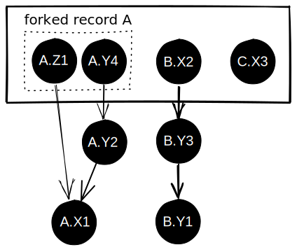

Using the Mapeo Core client you can perform CRUD (create, read, update, delete) operations on database records as you would any other database. However, because the Mapeo Core database is decentralized there are some subtle differences:

- **Read** operations can return more than one version of a record (called "forks"), if more than one device had updated the same record at the same time (similar to a branch in a git repo history).
- **Update** and **Delete** operations must reference the version of the record that was updated or deleted.
- **Delete** operations do not delete any data, they create a new version of a record with the property `deleted=true`.

### Append-only logs

Data in Mapeo is stored in append-only logs. Imagine that each action in Mapeo — create a point; edit a point; delete a point — is an entry in a log book. No entry can be modified, so each new action is added to the end of the log book. The append-only logs in Mapeo Core are built upon [Hypercore](https://hypercore-protocol.org/protocol/). Hypercore provides an efficient means of synchronizing logs between devices and verifies that logs are not changed using merkle trees and asymmetric cryptography. It's like a lightweight blockchain crossed with BitTorrent. For more info see the [Hypercore Protocol website](https://hypercore-protocol.org/protocol/).

### Materialized views

Each device in a Mapeo project has its own append-only log, and can only append data to its own log. Each version of a record is uniquely identified by the log ID and the entry number — or "sequence number" — within the log. E.g. the first entry in the log of device X would be identified by the version ID `X1`. If a user edits a record (e.g. a point on a map) from another user's log, they write the edit action to their own log, and reference the log and sequence number of the record they are editing. This creates a tree similar to a git repo: Each record in the Mapeo Core database has a history of edits distributed across one or more logs, with each edit linking to a previous version.

The key-value Mapeo Core indexer builds a materialized view of the latest versions of each record by following the links between record versions across all the logs that are part of a Mapeo project. E.g. in the diagram above, device Y edits record A, referencing the record A in position 1 or device X. The edit is stored on device Y at position 2. Then the same device Y edits record A again, writing the edit at position 4, referencing the version edited at position 2. The materialized view shows the "heads" of this chain of edits.

### Conflicts & forks

In a distributed system, it is possible that two users could edit the same record without knowledge of the other's edit. For example, imagine a third device in the scenario above, device Z, that has synchronized with device X but not with device Y, so it "knows" about record A.X1, but not the edits made by device Y. Now device Z edits record A, referencing A.X1, the version that it "knows" about.

Once all the devices sync, there are now two versions of record A that reference version X1: Z1 and Y2. This creates a "fork" — two users have made conflicting edits of the same record. This is similar to a branch in a git repo: there are now two "heads" linking back to the original record A. Mapeo Core does not try to resolve this fork, instead these two forks continue to exist and synchronize between all devices. Currently, the Mapeo apps show the most recently edited fork to the user, but in the future they could show the existence of a fork and allow the user to merge the conflicting versions, similar to merging branches in a git repo.

### Synchronization

A Mapeo Core project database consists of the append-only logs of all devices that are members of a project. Synchronization is the mechanism by which each device updates its local copy of the logs from other devices in the project, so that each device eventually ends up with a copy of exactly the same data. Since the logs are append-only and the entries in a log cannot be modified, synchronization just needs to copy missing records from each log between devices.

For example, device X has 3 logs:

- **log X** (its own log): has 10 entries
- **log Y** (a copy of the log from device Y): has 5 entries
- **log Z** (a copy of the log from device Z): has 2 entries

Device Y also has 3 logs:

- **log X** (a copy of the log from device X from a previous sync): has 6 entries
- **log Y** (its own log): has 7 entries
- **log Z** (a copy of the log from device Z, which Y has synced with more recently than X): has 4 entries

When device X and device Y sync, they first share what they have, then ask for what they are missing.

- Device X asks Y for entries 6–7 from log Y
- Device X asks Y for entries 3–4 from log Z
- Device Y asks X for entries 7–10 from log X

After this exchange is complete, device X and device Y end up with the same copies of logs X, Y and Z. Since entries in a log cannot be edited or deleted, sync only needs to ask for missing entries.
